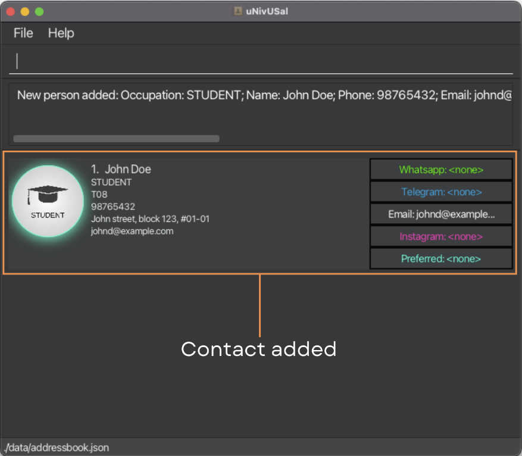
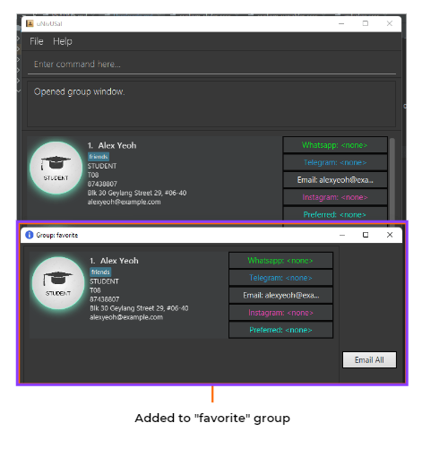
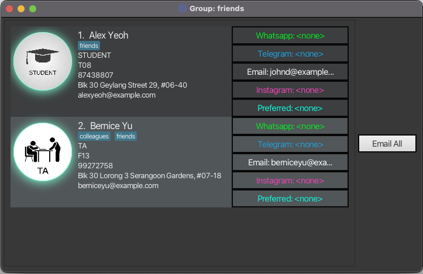
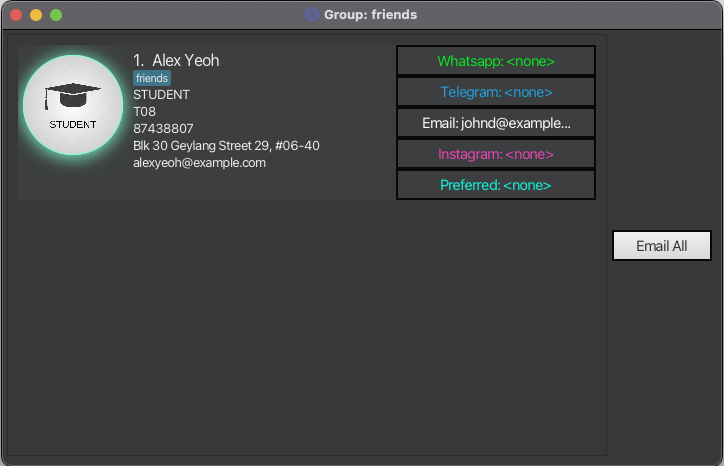
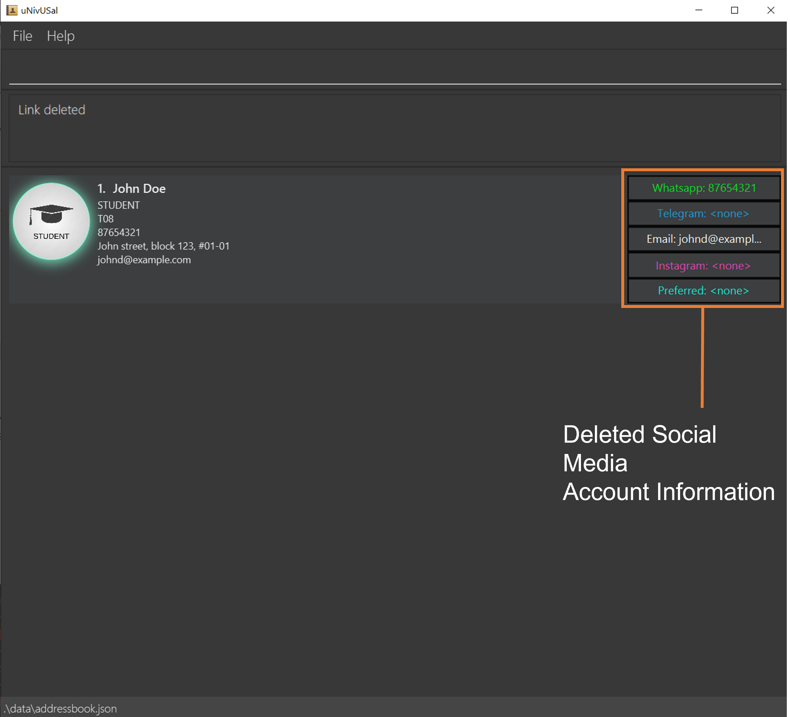
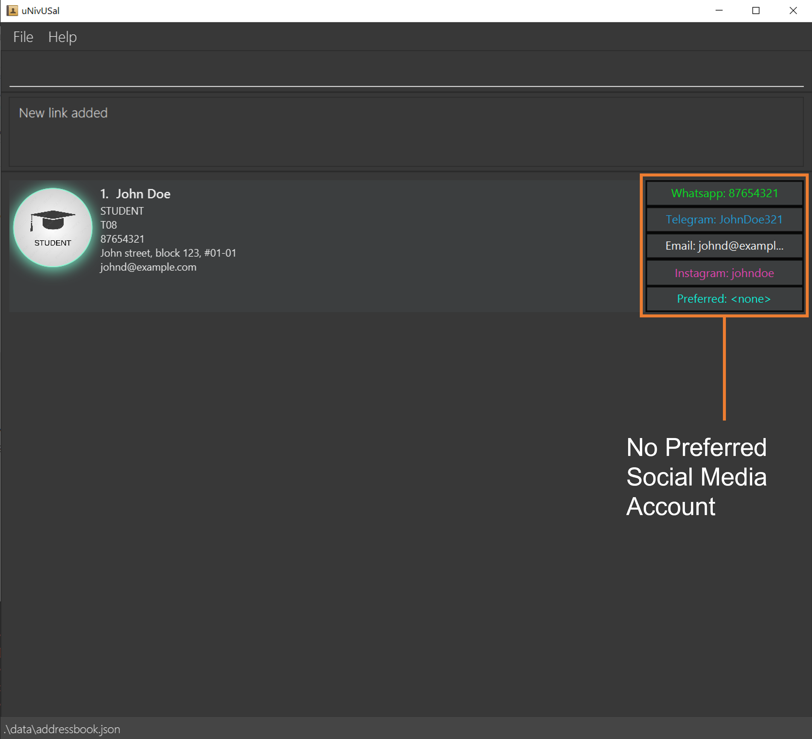
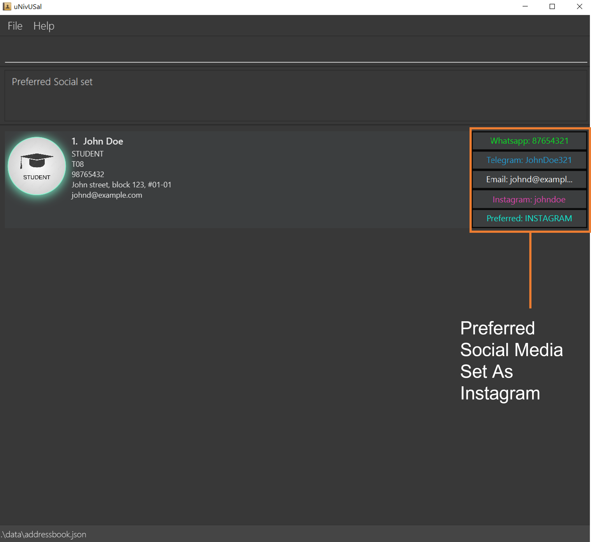
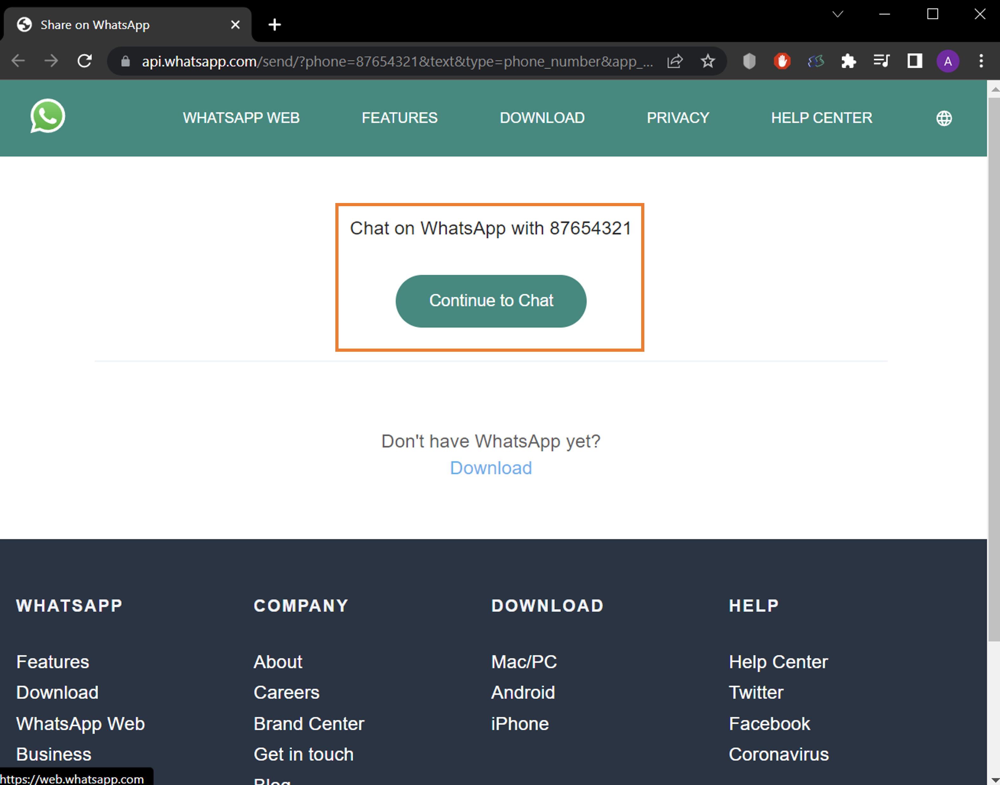
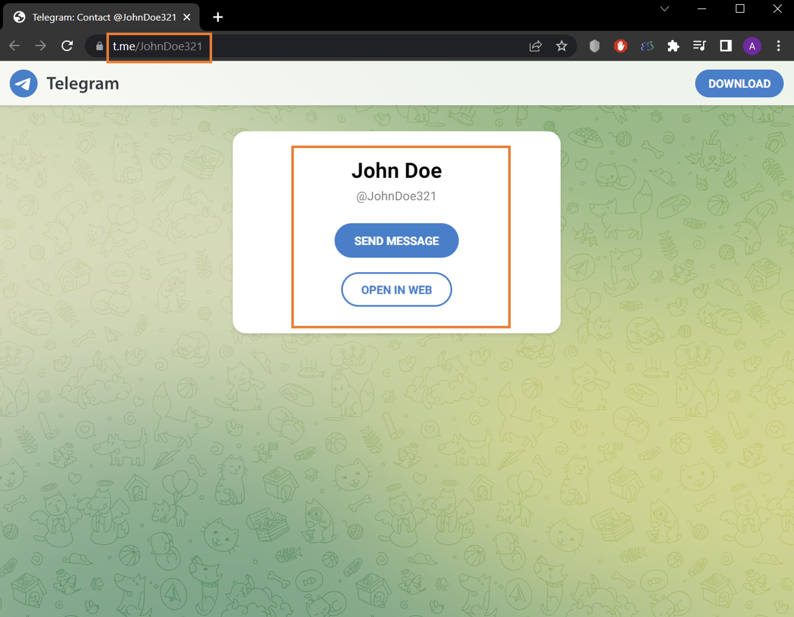
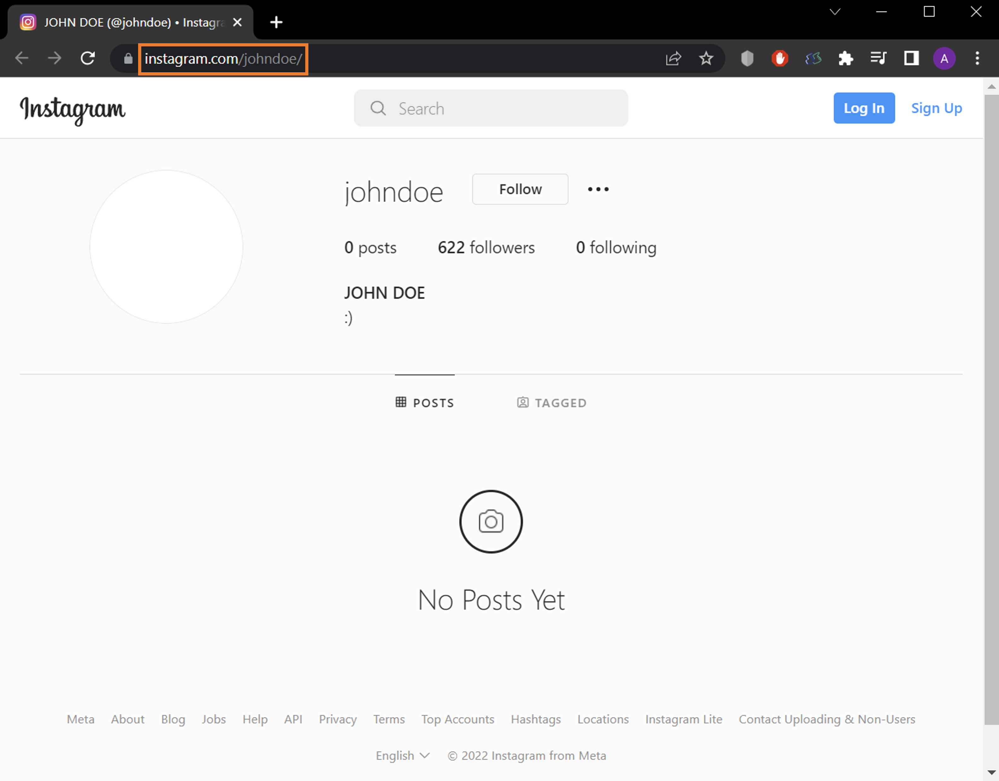

## Welcome to **uNivUSal's** User Guide!

Are you a **CS2103T student, TA, or professor**? 

Have you encountered the hassle of contact management in this CS2103T?

If so, **uNivUSal** is the contact management app for you! With **uNivUSal**, you will never have to worry about all the contact information of all your contacts. Gone are the days of frustrating over finding the contacts you need, and you will never be stressed about forgetting the contact information of the people you meet.

## Introduction

**uNivUSal** is a **desktop app for managing contacts catered to CS2103T students, TAs, and professors**, optimized for use
via a Command Line Interface (CLI) while still having the benefits of a Graphical User Interface (GUI). 
>:bulb: Confused over what CLI & GUI is? [Here's](https://www.hostinger.com/tutorials/what-is-cli) a link to get you up to speed!

In this user guide, you can find everything you need to know about **uNivUSal** starting with how to get started using **uNivUSal**, followed by instructions on how to use **uNivUSal** and all the exciting features you can explore.

>:bulb: If you are a developer, you might want to explore our [Developer Guide](https://ay2223s1-cs2103t-t08-3.github.io/tp/DeveloperGuide.html) instead.

## How to use **uNivUSal**'s User Guide?

If this is your first time using **uNivUSal**, welcome! Head over to the [Quick start](#quick-start) to get started!

If this is not your first time, and you have a specific feature you would like to know more about, checkout our [Table of Contents](#table-of-contents) to find what you are looking for!

Refer to the table below for the meanings of symbols used:

| Symbol                            | Meaning                                                                                                                                         |
|-----------------------------------|--------------------------------------------------|
| :information_source: **Notes**                 | Information that you **must** pay attention to.                                                                                                  |
| :bulb: **Tip**                                 | Information that you may find helpful.                                                                                                          |
| :exclamation: **Warning**                      | Information that you should be cautious about |

## Table of Contents
* [Quick start](#quick-start)
  * [Installation](#installation)
  * [Layout](#layout)
  * [Command Format](#command-format)
  * [Person Fields](#person-fields):
    1. [occupation](#a-occupation--o) : `o/`
    2. [name](#b-name--n) : `n/`
    3. [phone](#c-phone--p) : `p/`
    4. [email](#d-email--e) : `e/`
    5. [tutorial](#e-tutorial--tut) : `tut/`
    6. [address](#f-address--a) : `a/`
    7. [tags](#g-tags--t) : `t/`
* [Basic Commands](#basic-commands):
    1. [Adding a person](#a-adding-a-person-add) : `add`
    2. [Editing a person](#b-editing-a-person--edit) : `edit`
    3. [Deleting a person](#c-deleting-a-person-delete) : `delete`
    4. [Listing all persons](#d-listing-all-persons--list) : `list`
    5. [Clearing all entries](#e-clearing-all-entries--clear) : `clear`
    6. [Find a person](#f-find-entries-by-keywords-of-fields--find-keyword-eg-find-john) : `find`
    7. [Sorting entries by field](#g-sort-entries-by-field--sort-field_prefix-eg-sort-n) : `sort`
* [Enhanced Commands](#enhanced-commands):
    1. [Quickly edit a person](#a-quickly-edit-a-persons-features)
    2. [Add a person to favorite](#b-add-a-person-to-favorite--fav) : `fav`
    3. [Add a person to a group](#c-adding-a-person-to-a-group--addtogroup): `addtogroup`
    4. [Remove a person from a group](#d-removing-a-person-from-a-group--ungroup) : `ungroup`
    5. [Open a group window](#e-opening-a-group-window--group) : `group`
    6. [Email all persons in a group](#f-email-all-persons-in-a-group--emailall) : `emailall`
    7. [Add a person's social](#g-add-a-persons-socials--include) : `include`
    8. [Delete a person's social](#h-delete-a-persons-socials--exclude) : `exclude`
    9. [Set a person's preferred social media](#i-set-a-persons-preferred-social-media--prefer) : `prefer`
    10. [Open a person's social media](#j-open-a-persons-social-media--open) : `open`
    11. [Find persons with a preferred social media](#k-find-persons-with-a-preferred-social-media--social) : `social`
* [General App Commands](#general-app-commands):
    1. [Viewing help](#a-viewing-help--help) : `help`
    2. [Viewing history](#b-viewing-history--history) : `history`
    3. [Undoing last command](#c-undo-last-modification--undo) : `undo`
    4. [Exiting the app](#d-exiting-the-program--exit) : `exit`
* [FAQ](#faq)
* [Command summary](#command-summary)
* [Glossary](#glossary)

--------------------------------------------------------------------------------------------------------------------

## Quick start

### Installation 

Before starting on your **uNivUSal** exploration, here's a short guide on **uNivUSal**'s installation.

1. Ensure you have [Java `11`](https://www.oracle.com/java/technologies/javase/11-relnotes.html#:~:text=The%20Java%20Platform%2C%20Standard%20Edition,enhancements%20in%20many%20functional%20areas.) or above installed in your Computer.
Otherwise, you can install it [here](https://www.oracle.com/java/technologies/javase/jdk11-archive-downloads.html).

2. Download the latest [`uNivUSal.jar`](https://github.com/AY2223S1-CS2103T-T08-3/tp/releases/tag/v1.4.0).

    

3. Copy and move the file to the folder you want to use as the _home folder_ for your **uNivUSal**.

4. Double-click the file to start the app. The GUI similar to the image below should appear in a few seconds.
Note how the app contains some sample data. 
   

5. Type the command in the command box and press Enter to execute it. e.g. typing **`help`** and pressing Enter will
open the help window.

6. Refer to the [Basic Commands](#basic-commands), [Enhanced Commands](#enhanced-commands), [General App Commands](#general-app-commands) below for details of each command.

### Layout

New to **uNivUSal**? Confused with the unfamiliar interface? This section will help you through those problems and guide
you through **uNivUSal**'s layout!

#### General Layout
This is how **uNivUSal** will appear when you first launch your app. Now, let's proceed with each component.

#### Command Line

A command line is the place for you to type in all your commands. Try typing out `help` in the command line for a start!

#### Result Display

A result display is where you will see **uNivUSal**'s response to your commands! The response would either indicate a
success or error in the command you entered.

#### Person Card

A person card displays all the details of the person you inputted. For example, in the image above, the person has the
following details:
* Index - 1
* Name - Alex Yeoh
* Tag - friends
* Tutorial - T08
* Phone - 87438807
* Address - Blk 30 Geylang Street 29, #06-40
* Email - alexyeoh@example.com

Want a more detailed explanation on the person fields? Head over to this section: [Person Fields](#person-fields)

#### Social Box and Social Buttons

The highlighted feature of **uNivUSal** comes down to our [Socials](#g-add-a-persons-socials--include)! The social box is where you can find all of your
contact's socials (in the form of buttons), including their [preferred social](#i-set-a-persons-preferred-social-media--prefer).

Want to know more about our social feature? Head over to parts [g](#g-add-a-persons-socials--include) to [k](#k-find-persons-with-a-preferred-social-media--social) of our [Enhanced Commands](#enhanced-commands)!

### Command Format

**:information_source: Notes about the command format when using CLI before you start using uNivUSal:** 

* Words in `UPPER_CASE` are the parameters to be supplied by the user. 
  e.g. in `add n/NAME`, `NAME` is a parameter which can be used as `add n/John Doe`.

* Items in square brackets are optional. 
  e.g `n/NAME [t/TAG]` can be used as `n/John Doe t/friend` or as `n/John Doe`.

* Items with `…`​ after them can be used multiple times including zero times. 
  e.g. `[t/TAG]…​` can be used as ` ` (i.e. 0 times), `t/friend`, `t/friend t/family` etc.

* Parameters can be in any order. 
  e.g. if the command specifies `n/NAME p/PHONE_NUMBER`, `p/PHONE_NUMBER n/NAME` is also acceptable.

* If a parameter is expected only once in the command but you specified it multiple times, only the last occurrence of the parameter will be taken. 
  e.g. if you specify `p/12341234 p/56785678`, only `p/56785678` will be taken.

* Extraneous parameters for commands that do not take in parameters (such as `help`, `list`, `exit` and `clear`) will be ignored. 
  e.g. if the command specifies `help 123`, it will be interpreted as `help`.

### Person Fields

Still lost on the details you can add to a person? This section will walk you through all the person fields available for a person's contact in **uNivUSal**.

#### a. occupation : `o/`

Sets the occupation of a person in **uNivUSal**.

Format: `o/OCCUPATION`
* `OCCUPATION` includes `STUDENT`, `TA`, `PROFESSOR`.
* `OCCUPATION` is not case sensitive.
* `OCCUPATION` is a compulsory field of a person.

Example : `o/student`

#### b. name : `n/`

Sets the name of a person in **uNivUSal**.

Format: `n/NAME`
* `NAME` can be more than one word long but cannot be empty.
* `NAME` is a compulsory field of a person.

Example : `n/Shelby Peanuts`

#### c. phone : `p/`

Sets the phone number of a person in **uNivUSal**.

Format : `p/PHONE`
* `PHONE` must only contain digits and not alphabets, and it should be at least 3 and at most 15 digits long.

Example : `p/97865486`

#### d. email : `e/`

Sets the email of a person in **uNivUSal**.

Format : `e/EMAIL`

Emails should be of the format local-part@domain and adhere to the following constraints:
* The local-part should only contain alphanumeric characters and these special characters, excluding the parentheses, 
(+_.-). The local-part may not start or end with any special characters. 
* This is followed by a '@' and then a domain name. The domain name is made up of domain labels separated by periods.
 The domain name must:
  * end with a domain label at least 2 characters long 
  * have each domain label start and end with alphanumeric characters 
  * have each domain label consist of alphanumeric characters, separated only by hyphens, if any.

Example : `e/betty@u.nus.edu`

#### e. tutorial : `tut/`

Sets the tutorial group of a person in **uNivUSal**.

Format : `tut/TUTORIAL`
* `TUTORIAL` must contain a letter from `[F/T/W]` followed by two digits.

Example : `tut/T08`

#### f. address : `a/`

Sets the address of a person in **uNivUSal**.

Format : `a/ADDRESS`
* `ADDRESS` must be at most 100 characters long.

Example : `a/36 College Avenue`

#### g. tags : `t/`

Sets tag(s) of a person in **uNivUSal**.

Format : `t/TAGS`

Example : `t/classmate friend`

--------------------------------------------------------------------------------------------------------------------

## Basic Commands

At this point, you should be ready to explore the commands you can use in **uNivUSal**. This section will provide you with
the basic commands to get you started using **uNivUSal**.

### a. Adding a person: `add`

Let's start with our basic command, `add`! This command allows you to add a person to **uNivUSal**.

Format: `add o/OCCUPATION n/NAME [p/PHONE_NUMBER] [e/EMAIL] [tut/TUTORIAL] [a/ADDRESS] [t/TAG]…​`

:bulb: **Tip:**
A person can have any number of tags (including 0)

:bulb: **Tip:**
It is fine to add a person missing many details as long as the occupation and name are present.

Examples:
* `add o/STUDENT n/John Doe p/98765432 e/johnd@example.com tut/T08 a/John street, block 123, #01-01`
* `add o/TA n/Betsy Crowe e/betsycrowe@u.nus.edu`

### b. Editing a person : `edit`

Entered a typo you want to fix? Or do you simply want to update some parts of your contacts? The `edit` command is here
to help you edit an existing person in **uNivUSal**.

Format: `edit INDEX [o/OCCUPATION] [n/NAME] [p/PHONE] [e/EMAIL] [tut/TUTORIAL] [t/TAG]…​`

* Edits the person at the specified `INDEX`. The index refers to the index number shown in the displayed person list. The index **must be a positive integer** 1, 2, 3, …​
* At least one of the optional fields must be provided.
* Existing values will be updated to the input values.
* When editing tags, the existing tags of the person will be removed i.e adding of tags is not cumulative.
* You can remove all the person’s tags by typing `t/` without
  specifying any tags after it.

Examples:
* `edit 1 p/91234567 e/janedoe@example.com` Edits the phone number and email address of the 1st person to be `91234567`
and `janedoe@example.com` respectively.
* `edit 2 n/Betsy Crower t/` Edits the name of the 2nd person to be `Betsy Crower` and **clears** all existing tags.

#### c. Deleting a person: `delete`

Now you might have added a person with many incorrect fields, and would rather remove them instead. So to delete them from **uNivUSal**, use the `delete` command!

Format: `delete INDEX [PREFIX/]`

* Deletes the person at the specified `INDEX`.
* The index refers to the index number shown in the displayed person list.
* The index **must be a positive integer** 1, 2, 3, …​
* If [`PREFIX/`](#prefix) is provided, deletes the specified field of the person at the specified `INDEX`

Examples:
* Before `delete 1`, you will see the current list.

* After `delete 1`, the first person (Alex Yeoh) is removed from the list.

* After `delete 1 p/`, the first person (Alex Yeoh) has his phone number removed.

### d. Listing all persons : `list`

After experimenting with other commands, you might want to check back on all the people you currently have in **uNivUSal**.
To do so, simply type in the command `list`!

Format: `list`

### e. Clearing all entries : `clear`

If you feel like starting with a clean page, do the `clear` command which clears all entries from **uNivUSal**.

Format: `clear`
* Deletes every person in **uNivUSal**.
* Only a blank **uNivUSal** will remain.

### f. Find entries by keywords of fields : `find KEYWORD` e.g. `find John`

With so many contacts, it can be frustrating to scroll through them all. With the help of the `find` command, you can find entries in **uNivUSal** that match or contain case-insensitive keyword. Current fields searchable are:
1. Name
2. Phone Number

Format: `find KEYWORD`
* Filters the entries by the specified `KEYWORD`.
* Displays filtered list.

Examples:
* `find Alex` displays the entries filtered by names that contain the case-insensitive KEYWORD `Alex`.

* `find A` displays the entries filtered by names that contain the case-insensitive KEYWORD `A`.

### g. Sort entries by field : `sort FIELD_PREFIX/` e.g. `sort n/`

As your contact list in uNivUSal grows, you might find it hard to keep track of all your contacts. When you are looking
to organize your contacts, the `sort` command will help you do just that!

Sorts your entries easily in **uNivUSal** by specific field [prefix](#prefix) in an ascending manner. Current fields implemented are:
1. Name `n/`
2. Email address `e/`
3. Phone `p/`

Format: `sort FIELD_PREFIX/`
* Sorts the entries by the specified `FIELD_PREFIX/`.
* Displays sorted list.

Examples:
* Before `sort n/`, you would see the current unsorted list.

* After `sort n/`, all your contacts are alphabetically sorted by their name.

--------------------------------------------------------------------------------------------------------------------

## Enhanced Commands

Ready to get more out of **uNivUSal**? Here are the enhanced features you can experiment on to enhance your **uNivUSal** experience!  
Enhanced features **[b](#b-add-a-person-to-favorite--fav) to [f](#f-email-all-persons-in-a-group--emailall)** are the groups feature of **uNivUSal**.  
Enhanced features **[g](#g-add-a-persons-socials--include) to [k](#k-find-persons-with-a-preferred-social-media--social)** are the social features of **uNivUSal**.  

### a. Quickly edit a person's features

Quickly make small changes to a person by clicking on a person card while the command box is empty.
This creates an edit command with all the features that person currently has.
You may then modify this command to your needs.

### b. Add a person to favorite : `fav`

Thinking of a group of people important to you? Or perhaps a group of people you would want to easily find in uNivUSal?
The `fav` command is here to assist you! `fav` allows you to add the specified person to your `favorite` group.

Format: `fav INDEX`
* The index refers to the index number shown in the displayed person list.
* The index **must be a positive integer** 1, 2, 3, …​

Examples:
* `fav 1` will add 1st person in the current list to `favorite`. To open the `favorite` group, enter the `group favorite`.
You should see a new window pop up like the image below. Refer to [`group`](#e-opening-a-group-window--group) for more
information on accessing your `favorite` group.

### c. Adding a person to a group : `addtogroup`

When you're ready to start creating groups and adding people to them, use the `addtogroup` command! If the group does not exist yet, it creates it for you.

Format: `addtogroup INDEX GROUP`

* Adds the person at the specified `INDEX` to the specified `GROUP`.
* The index refers to the index number shown in the displayed person list.
* The index **must be a positive integer** 1, 2, 3, …​

Examples:
* `addtogroup 2 friends` adds the 2nd person in the current list to the group `friends`.
  

### d. Removing a person from a group : `ungroup`

If you want to remove a person from a group, simply `ungroup` them!

Format: `ungroup INDEX GROUP`

* Removes the person at the specified `INDEX` from the specified `GROUP`.
* The index refers to the index number shown in the displayed person list.
* The index **must be a positive integer** 1, 2, 3, …​

Examples:
* `ungroup 2 friends` ungroups the 2nd person in the current list from the group `friends`.
  

### e. Opening a group window : `group`

To see your `friends`, `colleagues`,  or any other groups, use the `group` command to open a new window where you can easily reach them!

Format: `group GROUPNAME`

* Opens a new window containing persons from the specified `GROUPNAME`.
* `GROUPNAME` should not contain spaces.

Examples:
* `group friends` opens a group window containing persons in the group `friends`.
  

### f. Email all persons in a group : `emailall`

What if you want to send an email to all the members of a group? With the `emailall` command, you can do just that!

Format: `emailall GROUPNAME`

* Opens the email client to all persons in `GROUPNAME`.
* `GROUPNAME` should not contain spaces.

Examples:
* `emailall friends` opens the email client to all persons in the group `friends`.
  
* Email client or web browser opens
  

### g. Add a person's socials : `include`

You can add a valid SOCIAL to an existing person in **uNivUSal** as shown below.

General format: `include INDEX s/SOCIAL #/SOCIAL_INFO`

* `SOCIAL` currently includes:
  * Whatsapp
  * Telegram
  * Email
  * Instagram
* `SOCIAL_INFO` currently includes:
  * Whatsapp phone number
  * Telegram username
  * Email
  * Instagram username
* `SOCIAL` is case-insensitive
* `INDEX` refers to the position of the contact in the list. See [Layout](#layout).

Format(WHATSAPP): `include INDEX s/WHATSAPP #/WHATSAPP_PHONE_NUMBER`

Format(Telegram): `include INDEX s/TELEGRAM #/TELEGRAM_USERNAME`

Format(Email): `include INDEX s/EMAIL #/EMAIL_ACCOUNT`

Format(Instagram): `include INDEX s/INSTAGRAM #/INSTAGRAM_USERNAME`

Examples:
* `include 1 s/WHATSAPP #/87654321` sets `87654321` as the whatsapp phone number of the 1st person in the contact list.
* `include 1 s/TELEGRAM #/JohnDoe321` sets `JohnDoe321` as the telegram username of the 1st person in the contact list.
* `include 1 s/EMAIL #/johnd@example.com` sets `johnd@example.com` as the social email of the 1st person in the contact list.
* `include 1 s/INSTAGRAM #/johndoe` sets `johndoe` as the instagram username of the 1st person in the contact list.
* Before running the above commands:  
  
* After running the above commands:  
  

> :information_source: **Notes about email and whatsapp phone number** 
> 1. EMAIL_ACCOUNT should be of the format `local-part@domain`  
> 2. WHATSAPP_PHONE_NUMBER should only contain numbers, and it should be at least 3 digits long. 
> 3. If the person already has an existing email account in **uNivUSal**, it will be added to the social. 
> 4. But the Phone number will not be added as the person's WHATSAPP_PHONE_NUMBER.

### h. Delete a person's socials : `exclude`

Made a mistake in entering a person's socials? You can delete a specified person's socials from **uNivUSal** as shown below.

Format: `exclude INDEX s/SOCIAL`

* `SOCIAL` currently includes:
  * Whatsapp
  * Telegram
  * Email
  * Instagram
  * Preferred
* `SOCIAL` is case-insensitive
* `INDEX` refers to the position of the contact in the list. See [Layout](#layout).

Examples:
* `exclude 1 s/TELEGRAM` deletes the telegram username of the 1st person in the contact list.
* `exclude 1 s/INSTAGRAM` deletes the instagram username of the 1st person in the contact list.
* Before running the above commands:  
  
* After running the above commands:  
  

### i. Set a person's preferred social media : `prefer`

Confused with all the social medias a person have? Want to know which social media they prefer? The `prefer` command is
here for you! You can set a specified person's preferred social media in **uNivUSal** as shown below.

Format: `prefer INDEX s/SOCIAL`

* `SOCIAL` currently includes:
  * Whatsapp
  * Telegram
  * Email
  * Instagram
* `SOCIAL` is case-insensitive
* `INDEX` refers to the position of the contact in the list. See [Layout](#layout).

Examples:
* `prefer 1 s/TELEGRAM` sets telegram as the preferred social media of the first person in the contact list.
* `prefer 1 s/INSTAGRAM` sets instagram as the preferred social media of the first person in the contact list.
* Before running the above commands:  
  
* After running `prefer 1 s/TELEGRAM`:  
  
* After running `prefer 1 s/INSTAGRAM`:  
  

### j. Open a person's social media : `open`

Aside from storing your contact's socials, you can also open their social media through **uNivUSal** as shown below!

Format: `open INDEX s/SOCIAL`

* `SOCIAL` currently includes:
  * Whatsapp
  * Telegram
  * Email
  * Instagram
  * Preferred (the person's currently preferred social media that has been set)
* `SOCIAL` is case-insensitive
* `INDEX` refers to the position of the contact in the list. See [Layout](#layout).

Examples:
* `open 1 s/WHATSAPP` opens the link to the whatsapp of the first person in the contact list.

  
* `open 1 s/TELEGRAM` opens the link to the telegram of the first person in the contact list.

  
* `open 1 s/INSTAGRAM` opens the link to the instagram of the first person in the contact list.

  
* `open 1 s/PREFERRED` opens the link to the preferred social media of the first person in the contact list.

> :information_source: **Notes on opening social** 
> The social media boxes are **buttons**!
> Clicking the social media boxes of the contacts will open the link to the social media of the person.
> Try it out!

### k. Find persons with a preferred social media : `social`

With the many forms of preferred social media, you might find it hard to keep track of the people preferring a specific
social media (e.g. Telegram). Well, the `social` command would easily ease your worries on this! By using the `social`
command, you can filter the current list to people by a specific preferred social media.

Format: `social SOCIAL`
* `SOCIAL` currently includes:
  * Whatsapp
  * Telegram
  * Email
  * Instagram
* `SOCIAL` is case-insensitive

Examples:
* Before `social telegram`, you will see all your contacts with their multiple preferred social media.

* After `social telegram`, you will see a filtered list of persons with `telegram` as their preferred social media.

 

--------------------------------------------------------------------------------------------------------------------

## General App Commands

Worried that you'd forget a command or typed in the wrong command? Our general app features is here to help you get through these worries!

### a. Viewing help : `help`

Shows a message explaining the basic features of the app and also provides a link to the website.

Format: `help`

### b. Viewing history : `history`

If you've forgotten the previous commands you've typed, use the `history` command which shows up to the previous five commands typed by the user.

Format: `history`

### c. Undo last modification : `undo`

Entered a command you did not want to do? Simply `undo` your latest command!

Format: `undo`
* Undoes the last modifying command.
* Ignores modifying commands if they don't modify the address book.
* Will cancel out when trying to undo an undo command. This means that you cannot undo the last two actions.

### d. Exiting the program : `exit`

Exits the program.

Format: `exit`

## Saving the data

**uNivUSal** data are saved in the hard disk automatically after any command that changes the data. So, you do not need to save manually.

## Editing the data file

**uNivUSal** data are saved as a [JSON](https://en.wikipedia.org/wiki/JSON) file `[JAR file location]/data/univusal.json`. Advanced users are welcome to update data directly by editing that data file.

:exclamation: **Caution:**
If your changes to the data file makes its format invalid, **uNivUSal** will discard all data and start with an empty data file at the next run.

## Archiving data files `[coming in v2.0]`

_Details coming soon ..._

--------------------------------------------------------------------------------------------------------------------

## FAQ

## General  
**Q**: How do I transfer my data to another Computer? 
**A**: You can install **uNivUSal** in the other computer and replace the empty data file it creates with the file that contains the data of your previous **uNivUSal** home folder.

**Q**: How do I make sure that my computer is running Java 11? 
**A**: Open the Terminal app built inside your computer (For Windows user, you can also use Powershell) and run the following command: java --version. The version should then be displayed on the application. If your screen is displaying java 11.x.x where x can be any number, then your computer is running Java 11.

**Q**: I cannot see any data when I first open **uNivUSal**, what do I do? 
**A**: Delete all the files under `[JAR file location]/data` and restart the jar application. You should be able to see some sample data now.
If your computer is not running Java 11, you can install it [here](https://www.oracle.com/java/technologies/javase/jdk11-archive-downloads.html). Please install according to the operating system that you are using (any of the options are fine, as they are all Java 11).

**Q**: Do I need an internet connection to run the app? 
**A**: No! **uNivUSal** stores your data offline so there is no need to worry about needing a connection to run.

## Cosmetics  
**Q**: Can I set my own images for certain contacts? 
**A**: Unfortunately not in this version of uNivUSal, although this is a feature we are aiming to roll out in the near future! 

##

--------------------------------------------------------------------------------------------------------------------

## Command summary

| Action                | Format, Examples                                                                                                                                                                                    |
|-----------------------|-----------------------------------------------------------------------------------------------------------------------------------------------------------------------------------------------------|
| **Help**              | `help`                                                                                                                                                                                              |
| **History**           | `history`                                                                                                                                                                                           |
| **Add**               | `add o/OCCUPATION n/NAME [p/PHONE_NUMBER] [e/EMAIL] [tut/TUTORIAL] [t/TAG]…​`  e.g., `add o/STUDENT n/James Ho p/22224444 e/jamesho@example.com tut/T08 a/123, Clementi Rd, 1234665 t/friend t/colleague` |
| **List**              | `list`                                                                                                                                                                                                       |
| **Edit**              | `edit INDEX [o/OCCUPATION] [n/NAME] [p/PHONE_NUMBER] [e/EMAIL] [tut/TUTORIAL] [t/TAG]…​`  e.g.,`edit 2 n/James Lee e/jameslee@example.com`                                                                |
| **Delete**            | `delete INDEX [OPTIONAL PREFIX/]`  e.g., `delete 3`,`delete 3 p/`                                                                                                                                         |
| **Clear**             | `clear`                                                                                                                                                                                                      |
| **Undo**              | `undo`                                                                                                                                                                                                       |
| **Sort**              | `sort FIELD_PREFIX/`   e.g., `sort n/`                                                                                                                                                                    |
| **Find**              | `find KEYWORD`   e.g., `find John / find J`                                                                                                                                                               |
| **Add To Group**      | `addtogroup INDEX GROUP`                                                                                                                                                                                     |
| **Ungroup**           | `ungroup INDEX GROUP`                                                                                                                                                                                        |
| **Open Group Window** | `group GROUPNAME`                                                                                                                                                                                            |
| **Favorite**          | `fav INDEX`                                                                                                                                                                                                  |
| **Include**           | `include INDEX s/SOCIAL #/SOCIAL_INFO`                                                                                                                                                                       |
| **Exclude**           | `exclude INDEX s/SOCIAL`                                                                                                                                                                                     |
| **Prefer**            | `prefer INDEX s/SOCIAL`                                                                                                                                                                                      |
| **Open**              | `open INDEX s/SOCIAL`                                                                                                                                                                                        |
| **Social**            | `social SOCIAL`                                                                                                                                                                                              |                                                                                                                                                                      |
| **Email All**         | `emailall GROUPNAME`                                                                                                                                                                                         |
| **Exit**              | `exit`                                                                                                                                                                                                       |

## Glossary

### Alphanumeric
- Words containing Alphabet letters and/or numbers only.

### CLI
- Command Line Interface. Click [here](https://www.hostinger.com/tutorials/what-is-cli) to learn more.

### Command
- An instruction you input for the application to execute.

### GUI
- Graphical User Interface. Click [here](https://www.hostinger.com/tutorials/what-is-cli) to learn more about the difference between CLI and GUI.

### Index
- The position of a contact in the list. See [Layout](#layout).

### JAR
- JAR stands for Java Archive and is used to store the files to run **uNivUSal**. You can double-click on JAR files to run it.

### JSON File
- JSON stands for JavaScript Object Notation and is used for storing your data in **uNivUSal**. Click [here](https://en.wikipedia.org/wiki/JSON) to learn more.

### OS
- OS stands for Operating System. **uNivUSal** can be run on OS such as Linux, macOS, and Windows.

### NUS
- National University of Singapore.

### Person Fields
- The fields of a person are their details, such as `NAME`, `OCCUPATION`, `PHONE`, `EMAIL` etc.

### Prefix
- Prefixes are used to differentiate the person fields of your input. `o/`, `n/`, `p/`, `e/`, `tut/`, `a/`, `t/`, `s/` and `#/`, are the different prefixes used in **uNivUSal**.

### SoC
- School of Computing
